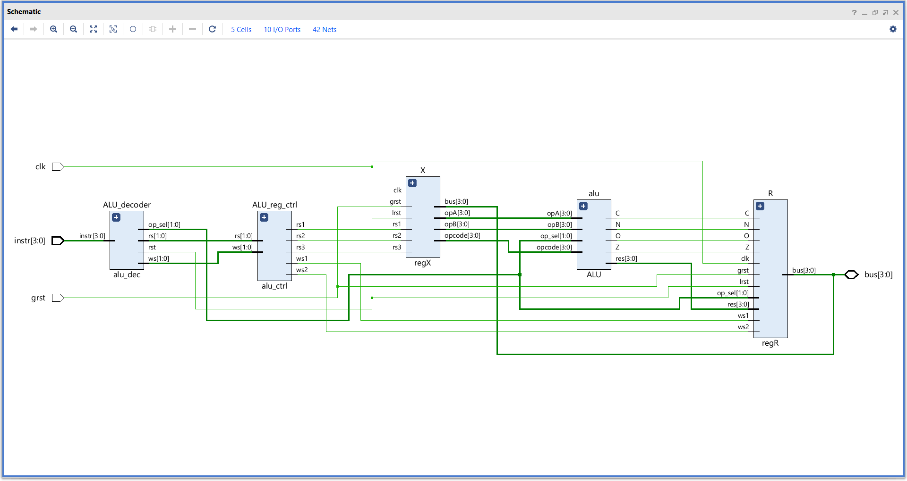
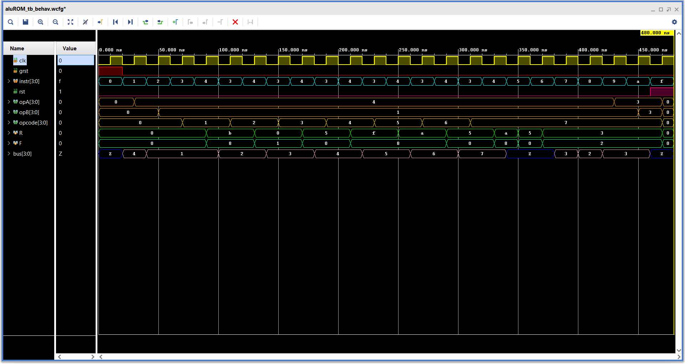

# **Arithmetic & Logic unit**

The ALU unit in this design can perform all the logic logic operations and two arithmetic operations.
The operation count is reduced to make the instruction allocation easier!!!

### **Overview :**
- The ALU with two registers forms the data operation and storage unit,
    1. Input register - X
        + Contains three memory elements - A operand, B operand and Operation selector.
        + The op selector is used to select is used for logic operation selector.
    2. Output register - Result
        + Has two memory elements - R and F registers.
        + R -> ALU result
        + F -> Flags
- Contains two resets,
    1. GRST -> Global reset (Hardware reset)
    2. LRST -> Local reset (Software reset)
- Both registers are connected to a single shared 4bit bus.
- The registers can perform below operations,
    1. X  -> Read from bus and directly forward the value to ALU
    2. R -> Read the ALU output and write to bus
    3. F -> Store flags set by the ALU and write to the bus
- The logic operations are controlled by the opcode but the arithmetic operations have their own dedicated instructions.
- The read write operations are controlled by a register control block which enables te required register operations based control signals given by the decoder.
- The instruction are given to the decoder in hex form where it is decoded to produce the requiered control signals.

---

### **Elaborated design :**


---
 
### **Instruction set :**

| Hex code | Operation          |
|:--------:|:------------------:|
| 0        | NOP                |
| 1        | MOV BUS, X1        |
| 2        | MOV BUS, X2        |
| 3        | MOV BUS, X3        |
| 4        | LOGIC              |
| 5        | ADD                |
| 6        | SUB                |
| 7        | MOV R, BUS         |
| 8        | MOV F, BUS         |
| 9        | MOV R, X1          |
| A        | MOV R, X2          |
| B        | (reserved)         |
| C        | (reserved)         |
| D        | (reserved)         |
| E        | (reserved)         |
| F        | CLEAR              |

---

### **Simulation :**

#### **Test sequence :**
```sv ,
{
    reg clk, grst,    // Clock and Global reset
    reg [3:0] instr,  // Instruction
    wire [3:0] bus // Data bus
    
    reg bus_write ;  // Enable bus simulation
    reg [3:0] bus_temp ;    // Temporary bus value
}

begin

    clk = 0 ; grst = 1 ; instr = 4'h0 ; bus_write = 0 ; bus_temp = 4'h0 ;  // Initial condition

    @( negedge clk ) ; grst = 0 ; bus_write = 1 ; bus_temp = 4'h4 ; instr = 4'h1 ; // MOV BUS -> X1
    @( negedge clk ) ; bus_temp = 4'h1 ; instr = 4'h2 ; // MOV BUS -> X2
    for( i = 1 ; i < 8 ; i = i + 1 )    // Loop to step through all the logic operations
    begin
        @( negedge clk ) ; bus_temp = i ; instr = 4'h3 ;    // MOV BUS -> X3
        @( negedge clk ) ; instr = 4'h4 ;   // LOGIC
    end
    @( negedge clk ) ; bus_write = 0 ; instr = 4'h5 ;   // ADD
    @( negedge clk ) ; instr = 4'h6 ;   // SUB
    @( negedge clk ) ; instr = 4'h7 ;   // MOV R -> BUS
    @( negedge clk ) ; instr = 4'h8 ;   // MOV FLAG -> BUS
    @( negedge clk ) ; instr = 4'h9 ;   // MOV R -> X1    
    @( negedge clk ) ; instr = 4'hA ;   // MOV R -> X2    
    @( negedge clk ) ; instr = 4'hF ;   // CLEAR
    @( negedge clk ) ; $finish ;

end

```

#### **Waveform :**

