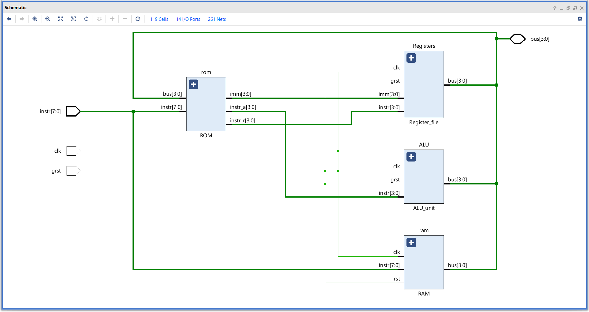
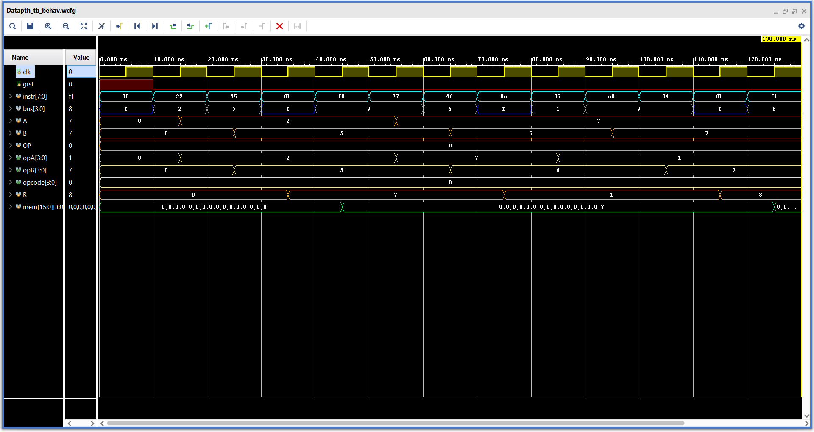

# **Datapath**

Combines Register file, ALU unit, RAM and ROM to form the complete dataflow path and control it.

### **Overview :**
- Connects all the data blocks.
- By combining all the data blocks makes it easier to interface with the main coontrol unit.
- The instructions will be given to the Datapath by the control unit where it will be passed to the data units.
- For more info on each part,   
    [**ROM**](https://github.com/ShreyasKombinadka/Simple-Hierarchical-MicroCode-Processor-4bit/tree/main/ROM)    
    [**Register file**](https://github.com/ShreyasKombinadka/Simple-Hierarchical-MicroCode-Processor-4bit/tree/main/Register_file)    
    [**ALU unit**](https://github.com/ShreyasKombinadka/Simple-Hierarchical-MicroCode-Processor-4bit/tree/main/ALU_unit)    
    [**RAM**](https://github.com/ShreyasKombinadka/Simple-Hierarchical-MicroCode-Processor-4bit/tree/main/RAM)

---

### **Elaborated design :**


---
 
### **Instruction set :**

| Hex code  | Operation          |
|:---------:|:------------------:|
| 00        | NOP                |
| 01        | MOV A, B           |
| 02        | MOV A, X1          |
| 03        | MOV B, A           |
| 04        | MOV B, X2          |
| 05        | MOV OP, X3         |
| 06        | MOV R, A           |
| 07        | MOV R, X1          |
| 08        | MOV R, B           |
| 09        | MOV R, X2          |
| 0A        | MOV F, BUS         |
| 0B        | LOGIC              |
| 0C        | ADD                |
| 0D        | SUB                |
| 0F        | CLEAR              |
| 20 - 2F	| LDI A & X1         |
| 40 - 4F	| LDI B & X2         |
| 60 - 6F	| LDI OP & X3        |
| A0 - AF	| MOV MEM, A         |
| B0 - BF	| MOV A, MEM         |
| C0 - CF	| MOV MEM, B         |
| D0 - DF	| MOV B, MEM         |
| F0 - FF	| MOV R, MEM         |

---

### **Simulation :**

#### **Test sequence :**
```sv ,
{
    clk, grst ; // Clock and Reset
    [7:0] instr ;   // Instruction
    [3:0] bus ;    // Databus
}

begin

    instr = 8'b0 ; grst = 1 ;
    @( negedge clk ) ; grst = 0 ; instr = 8'b0_01_0_0010 ; // 2 -> A
    @( negedge clk ) ; instr = 8'b0_10_0_0101 ; // 5 -> B
    @( negedge clk ) ; instr = 8'b0_00_0_1011 ; // ADD
    @( negedge clk ) ; instr = 8'b1_11_1_0000 ; // R -> ROM[0]
    @( negedge clk ) ; instr = 8'b0_01_0_0111 ; // 7 -> A
    @( negedge clk ) ; instr = 8'b0_10_0_0110 ; // 6 -> B
    @( negedge clk ) ; instr = 8'b0_00_0_1100 ; // SUB
    @( negedge clk ) ; instr = 8'b0_00_0_0111 ; // R -> X1
    @( negedge clk ) ; instr = 8'b1_10_0_0000 ; // ROM[0] -> B
    @( negedge clk ) ; instr = 8'b0_00_0_0100 ; // B -> X2
    @( negedge clk ) ; instr = 8'b0_00_0_1011 ; // ADD
    @( negedge clk ) ; instr = 8'b1_11_1_0001 ; // R -> ROM[1]
    
    @( negedge clk ) ; $finish ;

end
```

#### **Waveform :**

