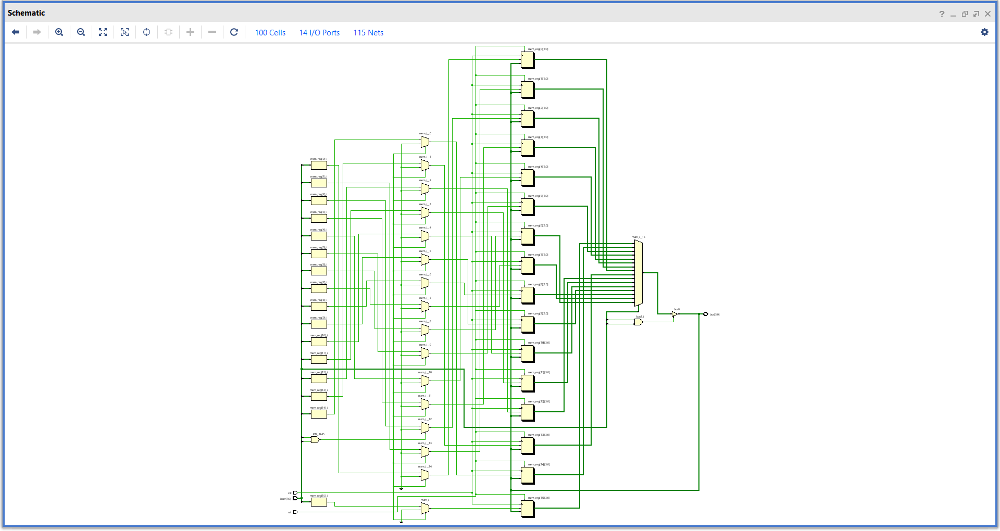
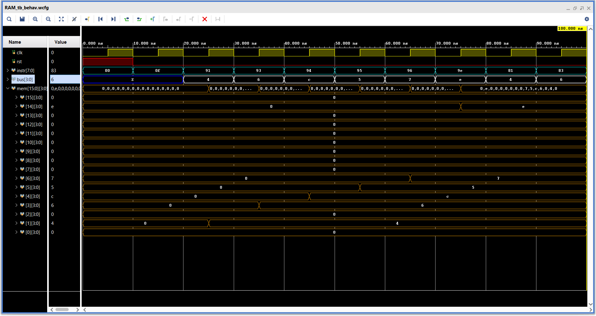

# **RAM**

A basic dynamic ram with 16 memory locations.

The design could have been built with more memory but this is a simple start, so i kept it smaller and fewer..!

### **Overview :**

- The RAM contains 16 memory locations.
- Conected to the the shared bus.
- The memory actions are supported by the MEMrom subrom.
- The subrom helps to synch the the register write and read actions with th memory.
- The MEMrom decodes the instruction and when a memory instruction received it produces the required the register control signals.

---

### **Instruction format :**

| instr bits      |  function               |
|:---------------:|:-----------------------:|
| instr[7]        | Memory operation enable |
| instr[6:5]      | Register select         |
| instr[4]        | Read - Write select     |
| instr[3:0]      | Memory location         |

---

### **Elaborated design :**


---

### **Simulation :**

#### **Test sequence :**
```sv ,
{
    clk,rst ;   // Clock and Reset
    instr [3:0] ;   // Instruction
    bus [3:0] ;    // Data bus
    
    bus_en ;    // Bus enable for testing
    temp [3:0] ;    // Temporary bus value
}

begin

    rst = 1 ; temp = 0 ; bus_en = 0 ; instr = 0 ;

    @( negedge clk ) ; rst = 0 ; instr = 8'b0_00_0_1111 ;   // instruction not ment for memory operation should be ignored by the memory
    @( negedge clk ) ; bus_en = 1 ; temp = 4'b0100 ; instr = 8'b1_00_1_0001 ;   // Write to mem[1]
    @( negedge clk ) ; temp = 4'b0110 ; instr = 8'b1_00_1_0011 ;    // Write to mem[3]
    @( negedge clk ) ; temp = 4'b1100 ; instr = 8'b1_00_1_0100 ;    // Write to mem[4]
    @( negedge clk ) ; temp = 4'b0101 ; instr = 8'b1_00_1_0101 ;    // Write to mem[5]
    @( negedge clk ) ; temp = 4'b0111 ; instr = 8'b1_00_1_0110 ;    // Write to mem[6]
    @( negedge clk ) ; temp = 4'b1110 ; instr = 8'b1_00_1_1110 ;    // Write to mem[12]
    @( negedge clk ) ; bus_en = 0 ; temp = 4'b0000 ; instr = 8'b1_00_0_0001 ;   // Read from mem[1]
    @( negedge clk ) ; instr = 8'b1_00_0_0011 ; // // Read from mem[3]
    @( negedge clk ) ; $finish ;

end
```

#### **Waveform :**

