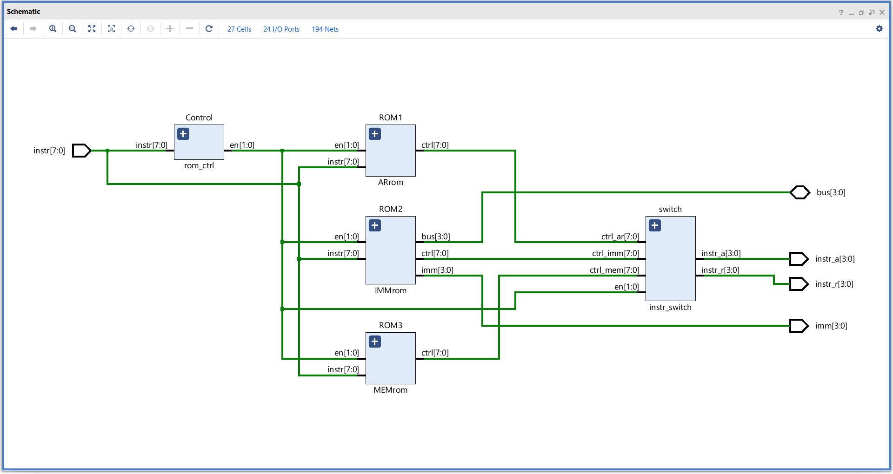
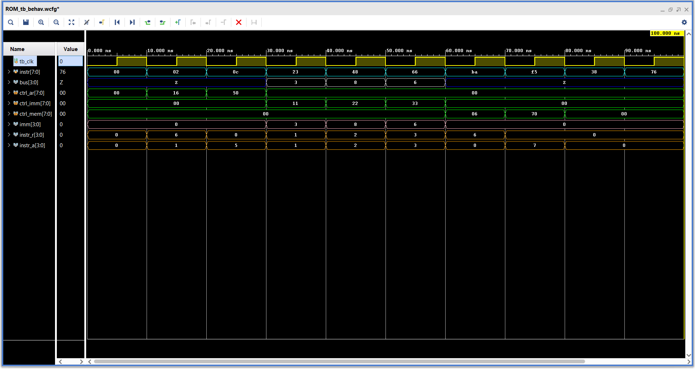

# **ROM**

Built to controll different operations through 3 subroms.

### **Overview :**

- Consists of three sub ROMs for different operations,
    1. AR ROM - General ALU and Register operations.
    2. IMM ROM - Immediate value loading.
    3. MEM ROM - Memory operations.
- Based on the instruction given the required subROM will be enabled by a control block.
- The enabled subROM will produce the required control signals for the Register and ALU blocks.
- The control signal will be multiplixed using the enable signal to pass only the required control signals to the lower blocks.

---

### **Elaborated design :**


---
 
### **Instruction :**

#### **Instruction classification**

##### **AR ROM :**

| instr bits     |Vlaue  |  function               |
|:--------------:|:-----:|:-----------------------:|
| instr[7]       | 0     |          ---            |
| instr[6:5]     | 00    |          ---            |
| instr[4]       | 0     |          ---            |
| instr[3:0]     | XXXX  | Instructions            |

##### **AR ROM :**

| instr bits     |Vlaue  |  function               |
|:--------------:|:-----:|:-----------------------:|
| instr[7]       | 0     |          ---            |
| instr[6:5]     | XX    | Register select         |
| instr[4]       | 0     |          ---            |
| instr[3:0]     | XXXX  | Immediate value         |

##### **MEM ROM :**

| instr bits     |Vlaue  |  function               |
|:--------------:|:-----:|:-----------------------:|
| instr[7]       | 1     | Memory operation enable |
| instr[6:5]     | XX    | Register select         |
| instr[4]       | X     | Read - Write select     |
| instr[3:0]     | XXXX  | Memory location         |

#### **Instruction mapping :**

##### **AR ROM :**

| Instr[3:0] | Operation          |
|:----------:|:------------------:|
| 0          | NOP                |
| 1          | MOV A, B           |
| 2          | MOV A, X1          |
| 3          | MOV B, A           |
| 4          | MOV B, X2          |
| 5          | MOV OP, X3         |
| 6          | MOV R, A           |
| 7          | MOV R, X1          |
| 8          | MOV R, B           |
| 9          | MOV R, X2          |
| A          | MOV F, BUS         |
| B          | LOGIC              |
| C          | ADD                |
| D          | SUB                |
| E          | (reserved)         |
| F          | CLEAR              |

##### **IMM ROM :**

| Instr[6:5] | Operation          |
|:----------:|:------------------:|
| 0          | NOP                |
| 1          | LDI A & X1         |
| 2          | LDI B & X2         |
| 3          | LDI OP & X3        |

##### **MEM ROM :**

> Note :- The MEM rom only controlls the register part of the  operations to assist in data movements, it only writes to the data to bus or reads data from the bus and memory writing and reading are done by the RAM itself depending on the instruction given, by reading or writing data to the bus.

| Instr[6:5] |Instr[4]| Operation          |
|:----------:|:------:|:------------------:|
| 0          |0       | NOP                |
| 1          |0       | MOV BUS, A         |
| 2          |0       | MOV BUS, B         |
| 3          |0       | CLEAR              |
| 0          |1       | NOP                |
| 1          |1       | MOV A, BUS         |
| 2          |1       | MOV B, BUS         |
| 3          |1       | MOV R, BUS         |

---

### **Simulation :**

#### **Test sequence :**
```sv ,
{
    [7:0] instr,  // Instruction
    [3:0] bus,    // Data bus
    [3:0] instr_r,  // Instruction for Register file block
    [3:0] instr_a,   // Instruction for ALU rom
    [3:0] imm    // Immediate value
    
    tb_clk ;    // Clock for testbench
}

begin

    instr = 0 ;
    @( negedge tb_clk ) ; instr = 8'h02 ;   // MOV A, X1
    @( negedge tb_clk ) ; instr = 8'h0C ;   // ADD
    @( negedge tb_clk ) ; instr = 8'h23 ;   // LDI A, 3
    @( negedge tb_clk ) ; instr = 8'h48 ;   // LDI B, 8
    @( negedge tb_clk ) ; instr = 8'h66 ;   // LDI OP, 6
    @( negedge tb_clk ) ; instr = 8'hBA ;   // MOV A, MEM[10]
    @( negedge tb_clk ) ; instr = 8'hF5 ;   // MOV R, MEM[5]
    @( negedge tb_clk ) ; instr = 8'h38 ;   // JNZ 8
    @( negedge tb_clk ) ; instr = 8'h76 ;   // J 6
    @( negedge tb_clk ) ; $finish ;

end
```

#### **Waveform :**

