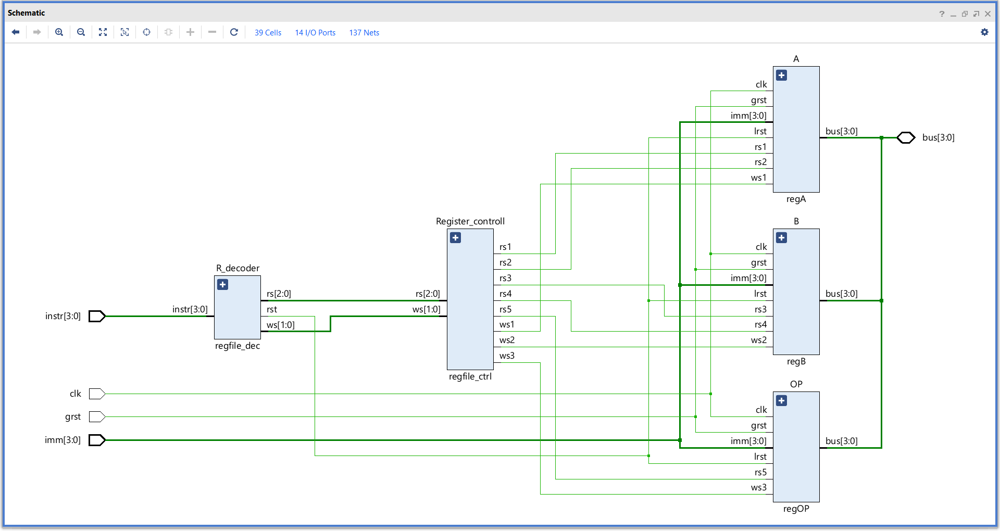

# **Register file**

A basic register file with minimal number of registers and operations.

### Overview :
- The register file consists of 3 registers,
    1. General purpose - A & B
    2. Specia purpose - OP
- Contains two resets,
    1. GRST -> Global reset (Hardware reset)
    2. LRST -> Local reset (Software reset)
- All three registers are connected to a single shared 4bit bus.
- The registers can perform specific operations,
    1. A & B  -> Load immediate and Read & Write to the bus
    2. OP -> Load immediate and Write to the bus
- The read write operations are controlled by a register control block which enables te required register operations based on the instruction given.
- The instruction are given to the decoder in hex form where it is decoded to produce the requiered control signals.

---

### Elaborated design :


---
 
### Instruction set :

| Opcode | Operation          |
|:------:|:------------------:|
| 0000   | NOP                |
| 0001   | LDI A              |
| 0010   | LDI B              |
| 0011   | LDI OP             |
| 0100   | MOV BUS, A         |
| 0101   | MOV BUS, B         |
| 0110   | MOV A, BUS         |
| 0111   | MOV B, BUS         |
| 1000   | MOV OP, BUS        |
| 1001   | MOV A, B           |
| 1010   | MOV B, A           |
| 1011   | MOV OP, A          |
| 1100   | MOV OP, B          |
| 1111   | CLEAR              |

---

### Simulation :

#### Test sequence :
```sv ,
{
    reg clk, grst,    // Clock and Global reset
    reg [3:0] imm,    // Immediate value
    reg [3:0] instr,  // Instruction
    wire [3:0] bus // Data bus
    
    reg bus_read ;  // Enable bus read
    reg [3:0] bus_temp ;    // Temporary bus value
}

begin
    grst = 1 ;
    imm = 4'h0 ; bus_read = 0 ; bus_temp = 4'h0 ; instr = 4'h0 ;    // NOP

    @( negedge clk ) ; grst = 0 ; imm = 4'hA ; instr = 4'h1 ;   // LDI A
    @( negedge clk ) ; imm = 4'h7 ; instr = 4'h2 ;  // LDI B
    @( negedge clk ) ; imm = 4'h5 ; instr = 4'h3 ;  // LDI OP
    @( negedge clk ) ; bus_read = 1 ; bus_temp = 4'h2 ; instr = 4'h4 ;  // MOV BUS, A
    @( negedge clk ) ; bus_read = 1 ; bus_temp = 4'h8 ; instr = 4'h5 ;  // MOV BUS, B
    @( negedge clk ) ; bus_read = 0 ; bus_temp = 4'h0 ; instr = 4'h6 ;  // MOV A, BUS
    @( negedge clk ) ; instr = 4'h7 ;   // MOV B, BUS
    @( negedge clk ) ; instr = 4'h8 ;   // MOV OP, BUS
    @( negedge clk ) ; instr = 4'h9 ;   // MOV A, B
    @( negedge clk ) ; instr = 4'h2 ;
    @( negedge clk ) ; instr = 4'hA ;   // MOV B, A
    @( negedge clk ) ; instr = 4'hB ;   // MOV OP, A
    @( negedge clk ) ; instr = 4'hC ;   // MOV OP, B
    @( negedge clk ) ; instr = 4'hF ;   // CLEAR
    @( negedge clk ) ; $finish ;
end
```

#### Waveform :

