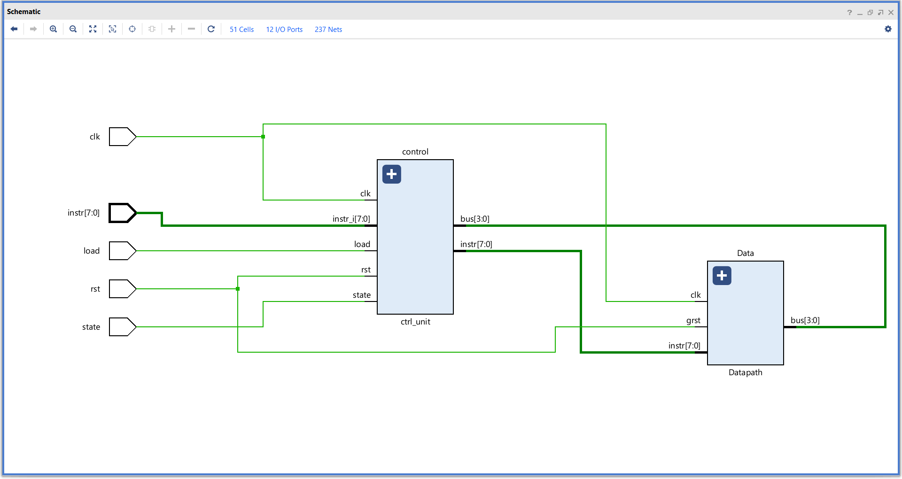
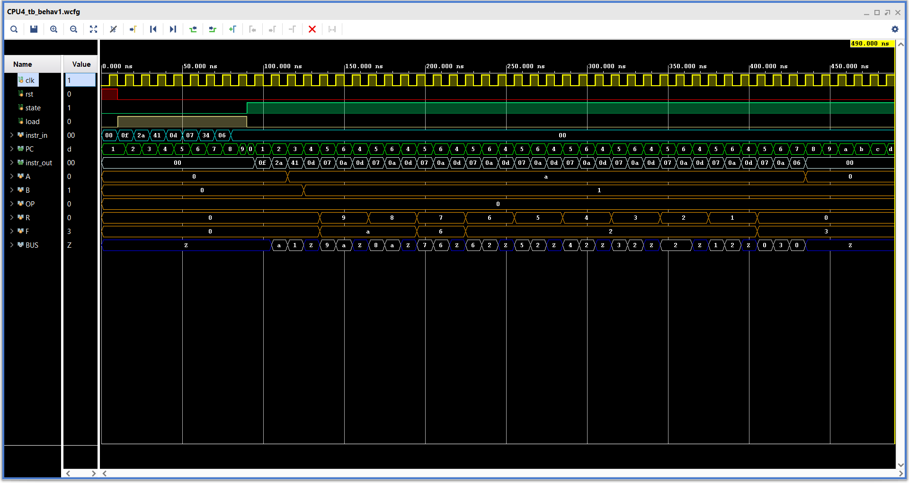

# **SHMCP-4**

The final block of the code which combines all the blocks to form a processer.

### **Overview :**
- The final processor is completed by connecting the control and datapath blocks.
- The processor is programmable by using the state and load signals.
>
- For more info on the working of Control and Datapath units,

    [**Control unit**](https://github.com/ShreyasKombinadka/Simple-Hierarchical-MicroCode-Processor-4bit/tree/main/control_unit)


    [**Datapath**](https://github.com/ShreyasKombinadka/Simple-Hierarchical-MicroCode-Processor-4bit/tree/main/Datapath)

---

### **Elaborated design :**


---
 
### **Instruction set :**

| Hex code  | Operation          |
|:---------:|:------------------:|
| 00        | NOP                |
| 01        | MOV A, B           |
| 02        | MOV A, X1          |
| 03        | MOV B, A           |
| 04        | MOV B, X2          |
| 05        | MOV OP, X3         |
| 06        | MOV R, A           |
| 07        | MOV R, X1          |
| 08        | MOV R, B           |
| 09        | MOV R, X2          |
| 0A        | MOV F, BUS         |
| 0B        | LOGIC              |
| 0C        | ADD                |
| 0D        | SUB                |
| 0F        | CLEAR              |
| 20 - 2F	| LDI A & X1         |
| 40 - 4F	| LDI B & X2         |
| 60 - 6F	| LDI OP & X3        |
| A0 - AF	| MOV MEM, A         |
| B0 - BF	| MOV A, MEM         |
| C0 - CF	| MOV MEM, B         |
| D0 - DF	| MOV B, MEM         |
| F0 - FF	| MOV R, MEM         |
| 30 - 3F	| JNZ                |
| 70 - 7F	| J                  |

---

### **Simulation :**

#### **Test sequence :**
```sv ,
{
    clk, rst ;  // Clock and Reset
    state ; // Enable for instruction load
    load ;  // Instruction load enable
    [7:0] instr ;   // Instruction input

}

begin

    rst = 1 ; state = 0 ; load = 0 ; instr = 0 ;
    @( negedge clk ) ; rst = 0 ; instr = 8'h0F ; load = 1 ;
    @( negedge clk ) ; instr = 8'h2A ;  // 10 -> A
    @( negedge clk ) ; instr = 8'h41 ;  // 1 -> B
    @( negedge clk ) ; instr = 8'h0D ;  // ADD ( A - B )
    @( negedge clk ) ; instr = 8'h07 ;  // R -> X1
    @( negedge clk ) ; instr = 8'h34 ;  // JNZ
    @( negedge clk ) ; instr = 8'h06 ;  // R -> A
    @( negedge clk ) ; instr = 8'h00 ;  // NOP
    
    #10
    @( negedge clk ) ; state = 1 ; load = 0 ;   // Run the programm
    #400 ; $finish ;

end

```

#### **Waveform :**

