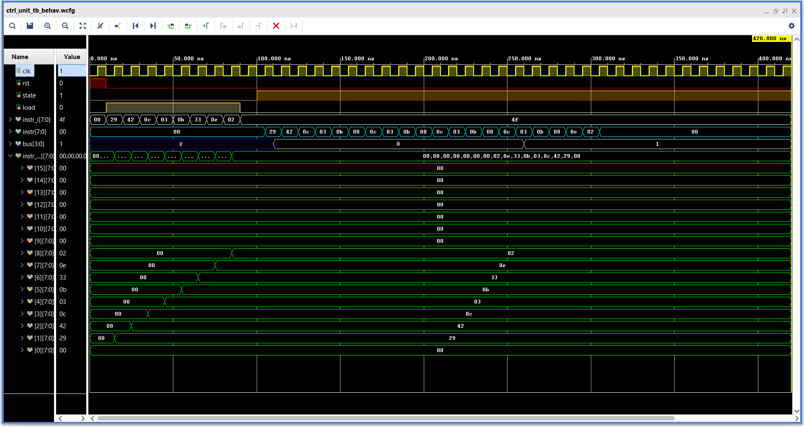

# **Control unit**

The master control block for the Datapath unit.

### **Overview :**
- The processor state is controlled by the state input,
    | State value  | State              |
    |:------------:|:------------------:|
    | 0            | Programming        |
    | 1            | Execute/Run        |
>
- The instruction loading to the memory is enabled by the Load input.
- Has a instruction memory with 15 locations to store the instructions.
- Has a PC with a size of 4-bits.
- The PC will be incrimented every time a instruction is added
- The first memory location is left as startup location so it is skipped by the PC while programming.
-  When the State is set to 0 the PC resets to 0 too and starts to incriment automatically.
- The Control block also contrins a PC control blocks, which oversees the instrution passing from instruction memory to Datapath.
- The PC control block manages the jump operations.
- PC control overwrites the PC value to the given Instruction memory location to perform looping.
- When a JNZ instruction is given it first makes trhe ALU unit to write the flag values to the bus, by passing the 'MOV F, BUS' instrucion.
- The Pc control then compares the ZERO flag and keeps jumping back to the specified instruction memory location till the Zero flag is raised.

---

### **Elaborated design :**


---
 
### **Instruction set :**

| Hex code | Operation          |
|:--------:|:------------------:|
| 30 - 3F  | JNZ                |
| 70 - 7F  | J                  |


---

### **Simulation :**

#### **Test sequence :**
```sv ,
{
    clk, rst ;  // Clock and Reset
    state ; // Enable for instruction load
    load ;  // Instruction load enable
    [7:0] instr_i ; // Instruction input
    [7:0] instr ;  // Instruction for the datapath
    [3:0] bus ;    // Data bus

    temp_load ; // Temp bus value enable
    [3:0] temp ;    // Temp bus value
}

begin

    rst = 1 ; state = 0 ; load = 0 ; instr_i = 0 ; temp_load = 0 ; temp = 0 ;
    @( negedge clk ) ; rst = 0 ; load = 1 ; instr_i = 8'b0_01_0_1001 ; // test sequence(Should be passed directly to Datapath)
    @( negedge clk ) ; instr_i = 8'b0_10_0_0010 ;   // test sequence(Should be passed directly to Datapath)
    @( negedge clk ) ; instr_i = 8'b0_00_0_1100 ;   // test sequence(Should be passed directly to Datapath)
    @( negedge clk ) ; instr_i = 8'b0_00_0_0011 ;   // test sequence(Should be passed directly to Datapath)
    @( negedge clk ) ; instr_i = 8'b0_00_0_1011 ;   // test sequence(Should be passed directly to Datapath)
    @( negedge clk ) ; instr_i = 8'b0_01_1_0011 ;   // JNZ ( jump address 0010 )
    @( negedge clk ) ; instr_i = 8'b0_00_0_1110 ;   // test sequence(Should be passed directly to Datapath)
    @( negedge clk ) ; instr_i = 8'b0_00_0_0010 ;   // test sequence(Should be passed directly to Datapath)
    @( negedge clk ) ; load = 0 ; instr_i = 8'b0_10_0_1111 ;   // test sequence(Should be passed directly to Datapath)
    
    @( negedge clk ) ; state = 1 ;  // Run the code
    @( negedge clk ) ; temp_load = 1 ; temp = 4'b0000 ; // Set zero flag low
    #150 ; 
    @( negedge clk ) ; temp_load = 1 ; temp = 4'b0001 ; // Set zero flag high

    #200 ; $finish ;

end

```

#### **Waveform :**

